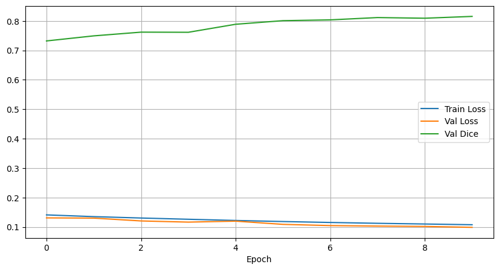
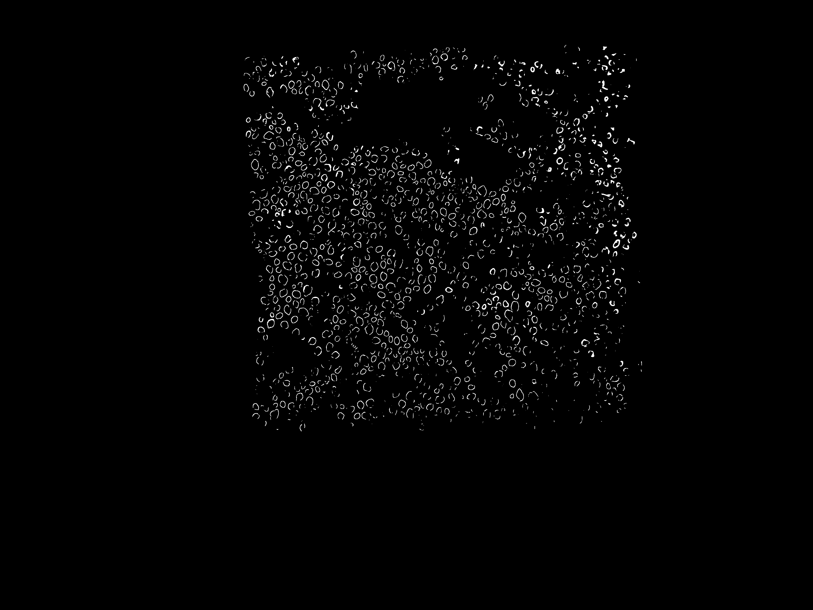
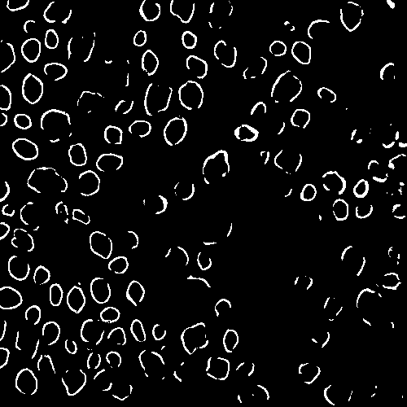

# barnacles

I explored solving the barnacles counting problem using several approaches, many of which failed to produce satisfactory results at first due to the limited despite tiling and aggressive augmentation (brightness, rotation, flips, scaling, etc.).

I avoided using standard OpenCV solutions to get a more generalized barnacles detector which did not rely on brightness and color properties of the seen and unseen images provided now. It would have been useful to use OpenCV to mask the regions outside of the target squares instead of using trusty GIMP if I had more time (*_nice.png).

I implemented a standard tiling routine to convert the images and corresponding masks into a larger number of training samples for both models.

My CNN approach uses a standard UNet([UNet implementation taken from here](https://github.com/milesial/Pytorch-UNet/tree/master/unet)] on a ResNet101 backbone with pretrained weights from ImageNet to allow perception of edges and shapes already. Then I trained it on 128x128 tiles with 12.5% overlap from the barnacles dataset. I used a relatively small tile size to both get a large number of tiles, and to make up for the difference in barnacle sizes from img2 vs img1 (I observed the former had larger barnacles). After 20 epochs, I get a dice score nearing 0.8 with a fair amount of learning for barnacle edges, though it could do with more training samples.

I attempted to use a Progressive Fine-Tuning Approach with the UNet model, training it on grayscaled MonuSeg nuclei images first and then on the limited barnacles dataset with frozen layers later, but it failed to converge.

For my second approach, I used a SOTA model in the same spirit, pretrained on a large number of medical imaging including nuclei and cells. CPSAM (Cellpose Segment Anything) post-trained on larger tiles (512x512) gave the best results among all my approaches since Segment Anything perfors better than UNet in instance segmentation. Admittedly, my UNet results often had touching outlines which would be characterized as single contours, so I used connected component analysis to obtain final counts in the CNN approach.

I would have like to experiment with an ensemble routine which used Cellpose's strength on small finer details in large images compared to UNet's strength in instance segmentation. Perhaps using a kind of averaging ensemble or a classifier to learn the properties of ground truth barnacle masks (such as area, solidity and eccentricity) might have helped. I think such an ensemble approach might be useful, especially with limited data, given how Cellpose performs much better at instance segmentation (barnacles to barnacels) while UNet performs better at semantic segmentation (barnacles to everything else).

